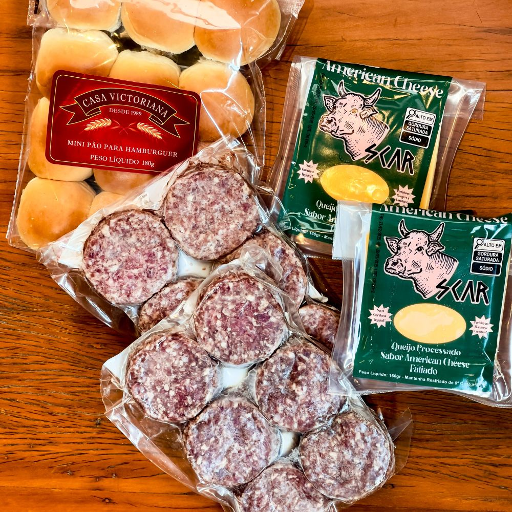

# 🥩 Rifa: Kit Mini Hambúrguer Gourmet 🍔

<p align="center">
  
</p>

## Sobre o Projeto
Este é o código-fonte de uma página web responsiva e dinâmica criada para a realização de uma rifa de 30 números. O objetivo é vender um **Kit Mini Hambúrguer Gourmet** (congelado) no valor de R$ 10,00 por número.

A principal característica do projeto é a integração com o Google Sheets, que permite a atualização em tempo real dos números vendidos, garantindo que o comprador veja apenas o que está disponível.

## 🔗 Link do Site
Acesse o site: [oimendes.github.io/rifa-kit-churrasco/](https://oimendes.github.io/rifa-kit-churrasco/)

## ✨ Funcionalidades

* **Grade de 30 Números:** Layout otimizado para a quantidade total da rifa.
* **Seleção Dinâmica:** O usuário pode selecionar vários números disponíveis na grade.
* **Integração com API (Google Sheets/Script):** Busca e exibe automaticamente os números que já foram vendidos, marcando-os como indisponíveis.
* **Cálculo Automático:** Calcula o valor total da compra em tempo real.
* **Botão WhatsApp:** Gera uma mensagem de reserva automática contendo o(s) número(s) escolhido(s) e o valor total, direcionando o comprador para o seu contato.
* **Design Responsivo:** Layout totalmente adaptável para celulares, tablets e desktops, com o quadro de detalhes (imagem e texto) configurado lado a lado em telas maiores.

## 🛠️ Tecnologias Utilizadas

| Tecnologia | Finalidade |
| :--- | :--- |
| **HTML5** | Estrutura da página e conteúdo. |
| **CSS3** | Estilização, layout Flexbox/Grid e responsividade. |
| **JavaScript (ES6)** | Lógica de seleção, consumo da API e geração da mensagem do WhatsApp. |
| **Google Apps Script** | API que conecta a planilha de controle de vendas com o site. |

## 🚀 Como Usar e Configurar

Para reutilizar este projeto, você precisará apenas de três ajustes principais:

### 1. Ajuste da API (Google Sheets)

O código usa um URL de API gerado via Google Apps Script para buscar os números vendidos. Se você mudar a planilha ou o Apps Script, atualize o link na linha 19 do arquivo `script.js`:

```javascript
// script.js (Linha 19)
const url = "NOVO_URL_DA_SUA_API/exec";
